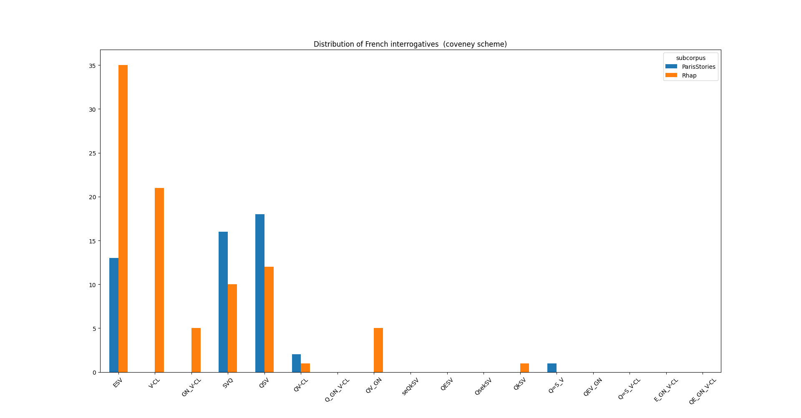

# stats.py

This python script can be used to count occurrences of French interrogative in the FIB or in any enriched UD annotated corpus.

## Requirements

`stats.py` uses the following python libraries:

 * `pandas`
 * `matplotlib.pyplot`
 * `argparse`
 * `grewpy` v. >= 0.4.3 (requires `grew`, see [https://grew.fr/usage/python/], grewpy_backend v. >= 0.5.1)

You can install them using `pip3`.

## Basic use

`stats.py` runs on enriched UD-annotated connl(u) files.

```bash
./stats.py fr_fib-ud-train_enriched.conll
```

If it doesn't work, try giving the execution permition to `stats.py`:

```bash
chmod u+x stats.py
```

Or run it with `python3`:

```bash
python3 stats.py fr_fib-ud-train_enriched.conll
```

## Annotation scheme: -s, --scheme

The program outputs a table of occurrences of French interrogatives, grouped by subcorpus and classified by category. The category set is given by the annotation scheme. Available annotation schemes are:

 * `coveney` (deffault)
 * `modular`
 * `embedded`
 * `no`

### `coveney`

The classification `coveney` (direct interrogatives only) is based on:

> Aidan Coveney. 2011. L’interrogation directe. Travaux de linguistique, 63(2):112–145. De Boeck Supérieur.

The list of categories is:
 * yes-no interrogatives:
   * `ESV`: 'est-ce que', e.g. *Est-ce que les autres / ils sont partis ?*
   * `V-CL`: clitic inversion, e.g. *Sont-ils partis ?*
   * `GN_V-CL`: complex inversion, e.g. *Les autres sont-ils partis ?*
 * constituent (fr. partielle):
   * `SVQ`: in situ, e.g. *Ils sont partis où ?*
   * `QSV`: fronting (fr. antéposition), e.g. *Où ils sont partis ?*
   * `QV-CL`: qu + clitic inversion, e.g. *Où sont-ils partis ?*
   * `Q_GN_V-CL`: qu + complex inversion, e.g. *Où les autres sont-ils partis ?*
   * `QV_GN`: qu + stylistic inversion, e.g. *Où sont partis les autres ?*
   * `seQkSV`: cleft, e.g. *C’est où qu’ils sont partis ?*
   * `QESV`: qu + 'est-ce que', e.g. *Où est-ce qu’ils sont partis ?*
   * `QsekSV`: qu + 'est-ce que' variant, e.g. *Où c’est qu’ils sont partis ?*
   * `QkSV`: qu + complementizer, e.g. *Où qu’ils sont partis ?*
   * `Q=S_V`: subject qu, e.g. *Lesquels sont partis ?*
 * hybrid (non-standard)
   * `QEV_GN`: qu+ 'est-ce que' + stylistic inversion, e.g. *Avec qui est-ce que travaille nicole Dupont ?*
   * `Q=S_V-CL`: subject qu + clitic inversion, e.g. *De ces fillettes, lesquelles sont-elles les tiennes ?*
   * `E_GN_V-CL`: 'est-ce que' + complex inversion, e.g. *Est-ce que demain les sauveteurs pourront-ils s’approcher des alpinistes en détresse ?*
   * `QE_GN_V-CL`: qu + 'est-ce que' + complex inversion e.g. *Qu’est-ce que le rédacteur de la rubrique des chats écrasés entend-il par un pachyderme ?*

**Note:** Contrary to [Coveney 2011], `stats.py` considers expression *qu'est-ce que/qui* as an interrogative word, and not as `Q` + *est-ce que* pattern.

### `modular`

WIP

### `embedded`

Subordinated interrogatives.

### `no`

With `no`, no grouping on syntactic pattern is performed.


## Output format: -f, --format

The available output formats are

 * `txt` (default)
 * `csv`
 * `json`
 * `plot`: bar plot
 * `sents`: list of raw text sentences exhibiting the pattern
 * `html`: list of text sentences exhibiting the pattern with html highlight
 * `svg`: list of highlighted graphs, saved under `results/svg/`
 * `png`: like `svg`, but converts to png with a white background

For some unknown reason, the png converter fails on some sentences. But the svg output should always work.

## Selecting subcorpora or class: -i, --include / -e, --exclude

Subcorpora or classes may be selected using the `-i` or `-e` flags. The list of available subcorpora is:

 * `FQB`
 * `Sequoia`
 * `GSD`
 * `ParTUT`
 * `PUD`
 * `Rhap` (Rhapsodie)
 * `ParisStories`

## Examples

Here are example uses:

```bash
./stats.py fr_fib-ud-train_enriched.conll fr_fib-ud-dev_enriched.conll fr_fib-ud-test_enriched.conll -f csv -s no
```

gives:

```csv
,subcorpus,all,Total
0,FQB,2234,2234
1,Sequoia,102,102
2,GSD,338,338
3,ParTUT,40,40
4,PUD,24,24
5,Rhap,138,138
6,ParisStories,137,137
7,Total,3013,3013
```

```bash
./stats.py fr_fib-ud-train_enriched.conll fr_fib-ud-dev_enriched.conll fr_fib-ud-test_enriched.conll -f plot -i ParisStories Rhap
```

gives:

